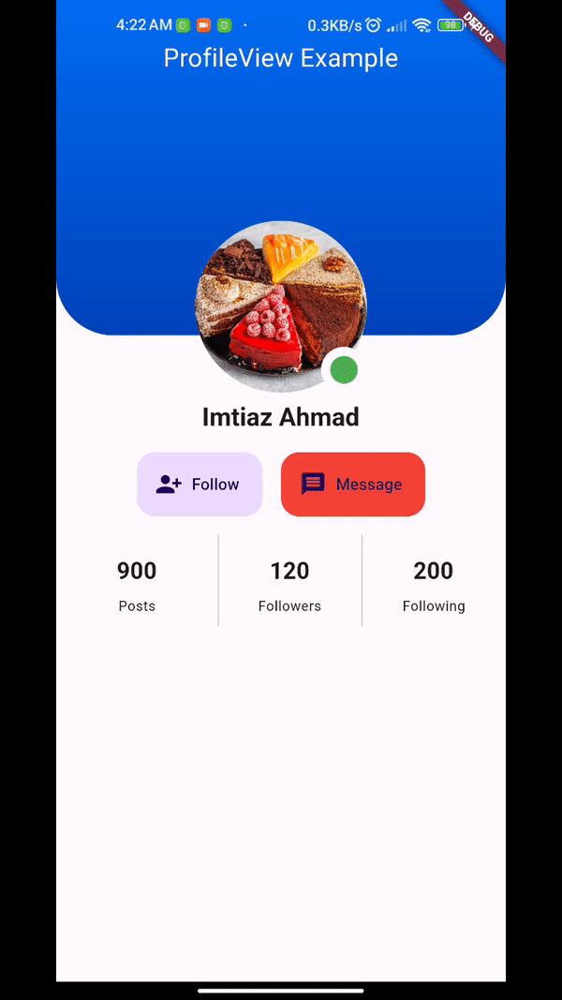

# profile_view

ProfileView is a Flutter package to open profile pictures in instagram style.



## Getting started

Just Provide Image to your  **ProfileView** and it'll do all the work.

## Usage

**Circle Shape Image [Default]**

```dart 
ProfileView(  
  image: NetworkImage(  
      "https://preview.keenthemes.com/metronic-v4/theme/assets/pages/media/profile/profile_user.jpg"
      ),  
),  
``` 

**Rectangle Image with Radius**

```dart 
ProfileView(
	height: 100,  
	width: 100,  
	circle: false, //set value to false
	borderRadius: 10,  //Corner circular Radius.
	image: NetworkImage(  
      "https://preview.keenthemes.com/metronic-v4/theme/assets/pages/media/profile/profile_user.jpg"
      ),  
),  
``` 

#### Example Usage

See [Example Code](example/lib/main.dart) for more info.

### Contributing

Every pull request is welcome.